# Hybrid LSTM-ARIMA CLI Forecasting System - Architecture Document

## 1. Executive Summary

This document describes the software architecture for a **Hybrid LSTM-ARIMA Command-Line Interface (CLI) Forecasting System** designed for cryptocurrency time series prediction. The system combines traditional statistical modeling (ARIMA) for linear components with deep learning (LSTM) for non-linear residual patterns.

The system operates in a **dual-space architecture**:
- **Input Space:** Raw price data (P_t)
- **Processing Space:** Returns space (R_t) - all internal computations
- **Output Space:** Dual outputs - both returns-space and reconstructed price-space forecasts

This dual-space approach provides flexibility: users can work with scale-free returns data for comparative analysis while also obtaining economically intuitive price-space predictions.

### 1.1 Core Assumption

The system models a time series in returns space as:

```
R_t = L_t + N_t + ε_t
```

Where:
- **R_t** = Observed returns at time t
- **L_t** = Linear component (captured by ARIMA)
- **N_t** = Non-linear component (captured by LSTM)
- **ε_t** = Random error term

The final forecasts are then provided in two formats:

1. **Returns-space forecast:** R̂_t (intermediate output)
2. **Price-space forecast:** P̂_t reconstructed using inverse formula

---

## 2. High-Level Architecture

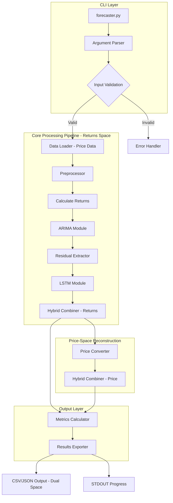

---

## 3. Component Architecture

### 3.1 System Components Overview

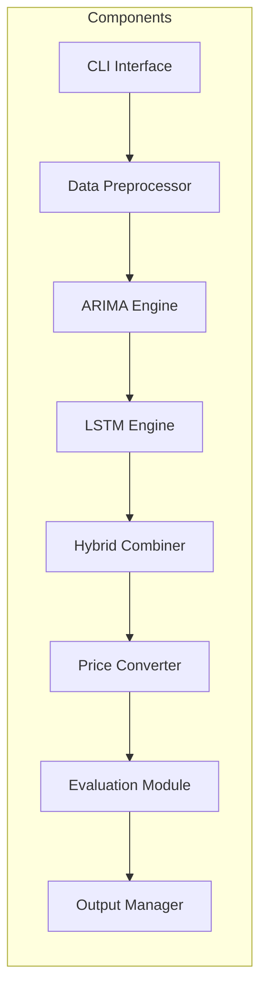

### 3.2 Component Responsibilities

| Component | Responsibility | Key Dependencies |
|-----------|----------------|------------------|
| CLI Interface | Parse arguments, validate inputs, orchestrate workflow | argparse/click |
| Data Preprocessor | Load price data, impute missing values, calculate returns | pandas, numpy |
| ARIMA Engine | Stationarity testing, auto-parameter selection, linear forecasting in returns space | statsmodels |
| LSTM Engine | Non-linear residual modeling in returns space, sequential pattern learning | tensorflow, keras |
| Hybrid Combiner | Combine ARIMA and LSTM components in returns space | numpy |
| Price Converter | Reconstruct forecasts from returns-space to price-space | numpy |
| Evaluation Module | Calculate RMSE/MAE in both spaces, walk-forward validation | numpy, sklearn |
| Output Manager | Export dual-space results to CSV/JSON, progress reporting | json, csv |

---

## 4. Detailed Component Design

### 4.1 CLI Interface Module

**File:** `forecaster.py`

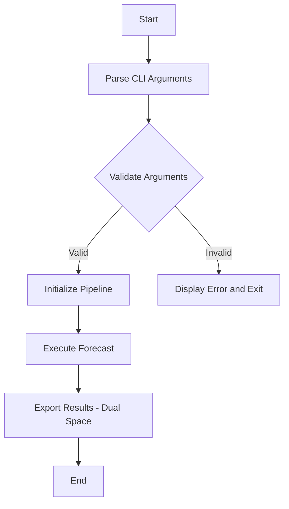

**CLI Arguments:**

| Argument | Type | Required | Description |
|----------|------|----------|-------------|
| `--input` | string | Yes | Path to input file - CSV or JSON containing price data |
| `--ticker` | string | Yes | Asset ticker symbol |
| `--horizon` | int | Yes | Forecast horizon - number of periods |
| `--output` | string | No | Output file path - default: stdout |
| `--config` | string | No | Path to model configuration file |

### 4.2 Data Preprocessor Module

**File:** `src/preprocessing.py`

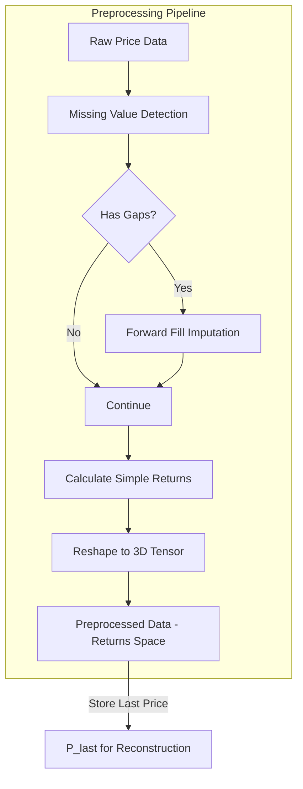

**Key Functions:**

| Function | Input | Output | Description |
|----------|-------|--------|-------------|
| `load_data` | file_path | pd.DataFrame | Load CSV/JSON price data |
| `impute_missing` | pd.Series | pd.Series | Forward fill missing values at t with t-1 |
| `calculate_returns` | pd.Series | pd.Series | Compute R_t = (P_t - P_t-1) / P_t-1 |
| `reshape_for_lstm` | np.array, window_size | np.array | Reshape to 3D: Samples, Time Steps, Features |

### 4.3 ARIMA Engine Module

**File:** `src/arima_engine.py`

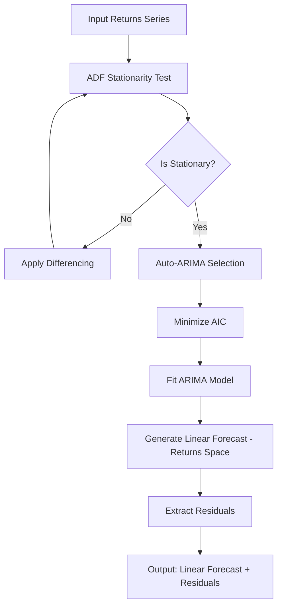

**Key Functions:**

| Function | Input | Output | Description |
|----------|-------|--------|-------------|
| `test_stationarity` | pd.Series | tuple - bool, p_value | Perform ADF test on returns |
| `find_optimal_params` | pd.Series | tuple - p,d,q | Auto-ARIMA with AIC minimization |
| `fit_arima` | pd.Series, params | ARIMAResults | Fit ARIMA model to returns |
| `extract_residuals` | pd.Series, ARIMAResults | pd.Series | Calculate residuals: actual - predicted returns |

### 4.4 LSTM Engine Module

**File:** `src/lstm_engine.py`

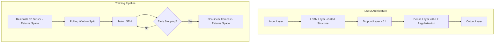

**LSTM Configuration:**

| Parameter | Default Value | Description |
|-----------|---------------|-------------|
| `hidden_layers` | 1 | Number of LSTM layers |
| `nodes` | 5-20 | Neurons per layer |
| `batch_size` | 64 | Training batch size |
| `dropout_rate` | 0.4 | Dropout regularization |
| `optimizer` | Adam | Optimization algorithm |
| `window_size` | 20-100 | Rolling window periods |

**Key Functions:**

| Function | Input | Output | Description |
|----------|-------|--------|-------------|
| `build_lstm_model` | config | keras.Model | Construct LSTM architecture |
| `create_rolling_windows` | data, window_size | X, y arrays | Generate training sequences from returns |
| `train_lstm` | model, X, y | trained model | Train with early stopping |
| `predict_residuals` | model, X | np.array | Generate non-linear predictions in returns space |

### 4.5 Hybrid Combiner Module

**File:** `src/hybrid_combiner.py`

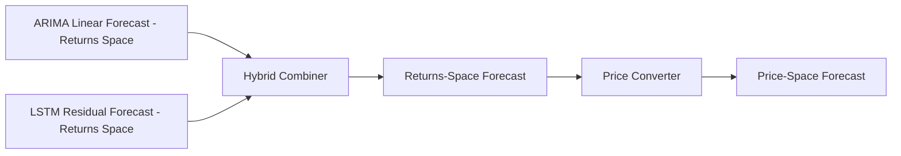

**Combination Formula - Returns Space:**

```
R̂_t = L̂_t + N̂_t

Where:
- R̂_t = Final hybrid returns forecast
- L̂_t = ARIMA linear prediction (returns space)
- N̂_t = LSTM residual prediction (returns space)
```

**Price-Space Reconstruction Formula:**

After combining predictions in returns space, convert to price space:

```
P̂_t = P_{t-1} × (1 + R̂_t)

Where:
- P̂_t = Final hybrid price forecast
- P_{t-1} = Last observed price
- R̂_t = Hybrid returns forecast from combination step
```

This formula inverts the simple returns calculation, converting percentage changes back to absolute prices.

### 4.6 Evaluation Module

**File:** `src/evaluation.py`

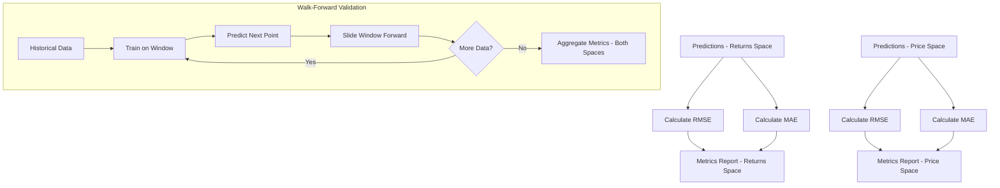

**Metrics - Calculated in Both Spaces:**

| Metric | Formula | Space | Description |
|--------|---------|-------|-------------|
| RMSE | √ mean of squared errors | Returns | Root Mean Squared Error in returns percentage |
| MAE | mean of absolute errors | Returns | Mean Absolute Error in returns percentage |
| RMSE | √ mean of squared errors | Price | Root Mean Squared Error in price units |
| MAE | mean of absolute errors | Price | Mean Absolute Error in price units |

---

## 5. Data Flow Architecture

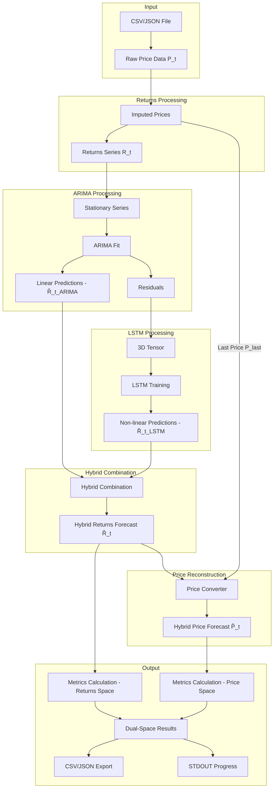

---

## 6. Directory Structure

```
LSTM_ARIMA_V2/
├── forecaster.py              # Main CLI entry point
├── config/
│   └── model_params.yml       # Model configuration
├── src/
│   ├── __init__.py
│   ├── preprocessing.py       # Data preprocessing module
│   ├── arima_engine.py        # ARIMA component
│   ├── lstm_engine.py         # LSTM component
│   ├── hybrid_combiner.py     # Hybrid combination logic
│   ├── price_converter.py     # Price-space reconstruction (future)
│   ├── evaluation.py          # Metrics and validation
│   └── output_manager.py      # Results export
├── tests/
│   ├── test_arima.py          # ARIMA unit tests
│   ├── test_lstm.py           # LSTM unit tests
│   └── test_hybrid_integration.py  # Integration tests
├── data/
│   └── sample/                # Sample input data
├── output/                    # Default output directory
├── plans/
│   └── architecture.md        # This document
├── requirements.txt           # Python dependencies
└── README.md                  # Project documentation
```

---

## 7. Configuration Schema

**File:** `config/model_params.yml`

```yaml
# ARIMA Configuration (operates on returns space)
arima:
  seasonal: false
  max_p: 5
  max_d: 2
  max_q: 5
  information_criterion: aic

# LSTM Configuration (operates on returns space residuals)
lstm:
  hidden_layers: 1
  nodes: 10
  batch_size: 64
  epochs: 100
  dropout_rate: 0.4
  l2_regularization: 0.01
  window_size: 60
  optimizer: adam
  early_stopping_patience: 10

# Validation Configuration
validation:
  method: walk_forward
  test_size: 0.2

# Hardware Configuration
hardware:
  use_opencl: true
  gpu_memory_fraction: 0.8

# Output Configuration
output:
  include_returns_space: true
  include_price_space: true
  metrics_in_both_spaces: true
```

---

## 8. Technology Stack

### 8.1 Runtime Requirements

| Requirement | Specification |
|-------------|---------------|
| Python Version | 3.11+ |
| Operating System | Cross-platform - Windows, Linux, macOS |

### 8.2 Core Dependencies

| Library | Version | Purpose |
|---------|---------|---------|
| pandas | >= 2.0 | Data manipulation |
| numpy | >= 1.24 | Numerical computing |
| statsmodels | >= 0.14 | ARIMA modeling, ADF tests |
| tensorflow | >= 2.15 | LSTM backend |
| keras | >= 3.0 | LSTM high-level API |
| scikit-learn | >= 1.3 | Metrics, preprocessing |
| argparse/click | stdlib/latest | CLI argument parsing |
| PyYAML | >= 6.0 | Configuration loading |
| pyopencl | >= 2023.1 | GPU acceleration - optional |

### 8.3 Standard Library Usage

- `pathlib` - File path handling
- `logging` - Training progress logging
- `math` - Mathematical operations
- `json` - JSON I/O
- `csv` - CSV I/O

---

## 9. Interface Contracts

### 9.1 Main Entry Point

```python
def run_hybrid_forecast(
    data: pd.DataFrame,
    forecast_horizon: int,
    config: dict = None
) -> dict:
    """
    Execute complete hybrid forecasting workflow with dual-space output.

    Args:
        data: Cleaned cryptocurrency price time series
        forecast_horizon: Number of time steps to forecast
        config: Optional model configuration overrides

    Returns:
        dict containing:
            - predictions_returns: np.array of forecast values (returns space)
            - predictions_price: np.array of forecast values (price space)
            - arima_component: np.array of linear predictions (returns space)
            - lstm_component: np.array of residual predictions (returns space)
            - metrics_returns: dict with RMSE and MAE (returns space)
            - metrics_price: dict with RMSE and MAE (price space)
            - model_params: dict with fitted ARIMA (p,d,q) params
            - last_price: float - price used for reconstruction
    """
```

### 9.2 CLI Interface

```bash
# Basic usage - outputs both returns and price space
python forecaster.py --input data/btc_prices.csv --ticker BTC --horizon 10

# With custom output - CSV includes both space columns
python forecaster.py --input data/eth_prices.json --ticker ETH --horizon 30 --output results/forecast.csv

# With custom configuration
python forecaster.py --input data/btc_prices.csv --ticker BTC --horizon 10 --config config/custom_params.yml
```

**Output Format - CSV (Dual Space):**

```
timestamp,prediction_returns,prediction_price,arima_component,lstm_component
t1,0.0125,50125.50,0.0100,0.0025
t2,0.0089,50570.25,0.0080,-0.0009
t3,-0.0034,50296.18,-0.0045,0.0011
```

**Output Format - JSON (Dual Space):**

```json
{
  "timestamp": "2026-01-15T08:00:00",
  "ticker": "BTC",
  "horizon": 10,
  "predictions_returns": [0.0125, 0.0089, -0.0034, ...],
  "predictions_price": [50125.50, 50570.25, 50296.18, ...],
  "arima_component": [0.0100, 0.0080, -0.0045, ...],
  "lstm_component": [0.0025, -0.0009, 0.0011, ...],
  "metrics_returns": {
    "rmse": 0.0045,
    "mae": 0.0032
  },
  "metrics_price": {
    "rmse": 225.50,
    "mae": 160.25
  },
  "model_params": {
    "arima_order": [1, 1, 1],
    "last_price": 50000.00
  }
}
```

---

## 10. Error Handling Strategy

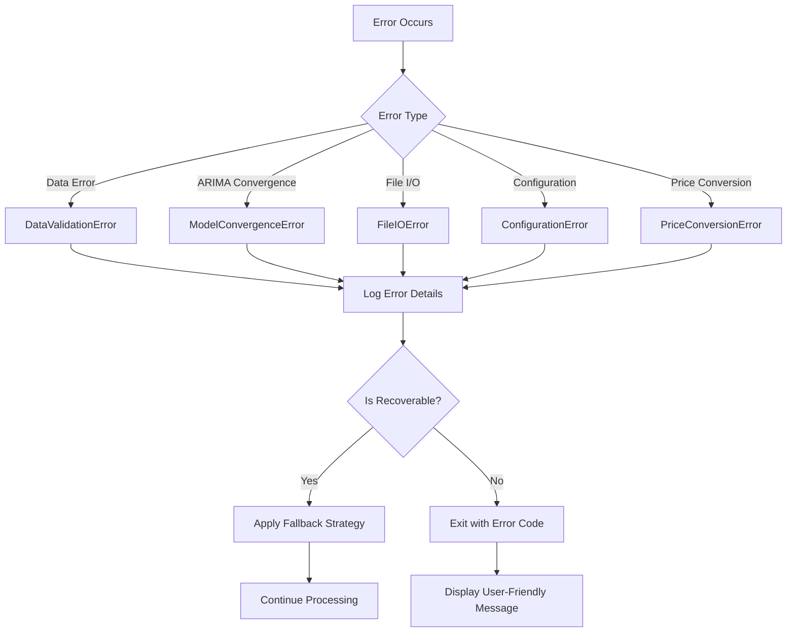

| Error Type | Recovery Strategy |
|------------|-------------------|
| Missing data file | Exit with clear file path error |
| Non-convergent ARIMA | Log warning, use default params |
| Invalid ticker | Exit with valid options list |
| GPU unavailable | Fallback to CPU processing |
| Price conversion failure | Return returns-space only, log warning |

---

## 11. Validation Strategy

### 11.1 Walk-Forward Validation - Dual Space

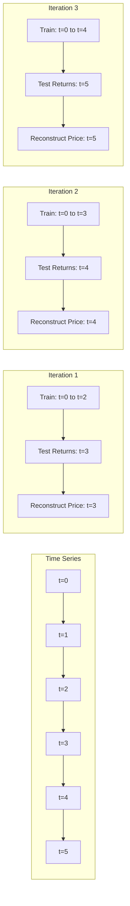

### 11.2 Test Coverage

| Test Type | File | Coverage |
|-----------|------|----------|
| Unit Tests | `test_arima.py` | ADF test, ARIMA fitting in returns space |
| Unit Tests | `test_lstm.py` | Model construction, tensor reshaping from returns |
| Unit Tests | `test_price_converter.py` | Price-space reconstruction mathematics |
| Integration Tests | `test_hybrid_integration.py` | End-to-end dual-space pipeline |

---

## 12. Hardware Acceleration

### 12.1 OpenCL Integration

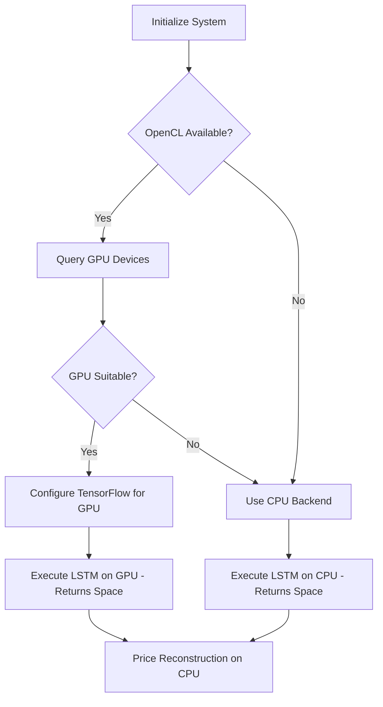

### 12.2 Performance Considerations

| Operation | CPU | GPU with OpenCL |
|-----------|-----|-----------------|
| ARIMA fitting (returns space) | Default | N/A - CPU only |
| LSTM training (returns space) | Slow | Accelerated |
| Price reconstruction | Fast | Not needed |
| Matrix operations | NumPy | OpenCL parallelization |

---

## 13. Acceptance Criteria

| ID | Criterion | Validation Method |
|----|-----------|-------------------|
| AC1 | Hybrid model RMSE (returns space) is lower than standalone ARIMA benchmark | Integration test comparison |
| AC2 | Model saves and loads training states to .pkl or .h5 files | Unit test for serialization |
| AC3 | No temporal data leakage | Code review, validation test |
| AC4 | LSTM activation encompasses residual range of -2 to 2 | Architecture verification |
| AC5 | CLI accepts all specified arguments | CLI integration test |
| AC6 | Progress output to STDOUT during training | Manual verification |
| AC7 | CSV/JSON output contains both returns-space and price-space forecasts | Output file inspection |
| AC8 | Price-space reconstruction uses correct formula: P̂_t = P_{t-1} × (1 + R̂_t) | Unit test for conversion |
| AC9 | Metrics calculated correctly in both spaces | Cross-validation tests |

---

## 14. Security and Constraints

### 14.1 Data Integrity Constraints

- **Temporal Order:** No future data leakage - strict train/test separation
- **Data Validation:** Input validation before processing
- **Error Boundaries:** Graceful degradation on invalid inputs
- **Space Consistency:** Returns-space used for all modeling, price-space only for output

### 14.2 Model Constraints

- LSTM activation must handle residual correlation range of -2 to 2 (returns space)
- ARIMA differencing limited to d <= 2 for stability (returns space)
- Early stopping to prevent overfitting
- Price reconstruction requires valid last price value
- Negative prices post-reconstruction should trigger warning

---

## 15. Appendix: Mathematical Foundations

### 15.1 Simple Returns Calculation (Price → Returns)

```
R_t = (P_t - P_{t-1}) / P_{t-1}
```

**Example:**
- P_{t-1} = 100
- P_t = 102
- R_t = (102 - 100) / 100 = 0.02 (2% return)

### 15.2 Price Reconstruction (Returns → Price)

```
P̂_t = P_{t-1} × (1 + R̂_t)
```

**Example:**
- P_{t-1} = 100
- R̂_t = 0.02 (predicted 2% return)
- P̂_t = 100 × (1 + 0.02) = 102

This formula is the inverse of simple returns calculation and reconstructs absolute prices from percentage returns.

### 15.3 Multi-Step Price Reconstruction (For Horizon > 1)

```
P̂_{t+1} = P_t × (1 + R̂_{t+1})
P̂_{t+2} = P̂_{t+1} × (1 + R̂_{t+2})
...
P̂_{t+h} = P̂_{t+h-1} × (1 + R̂_{t+h})
```

Each step compounds on the previous reconstructed price, creating a continuous price path.

### 15.4 ADF Test Hypothesis (Returns Space)

- H0: Series has a unit root (non-stationary)
- H1: Series is stationary
- Reject H0 if p-value < 0.05

Conducted on returns series to ensure stationarity before ARIMA modeling.

### 15.5 ARIMA Model (Returns Space)

```
(1 - Σφ_i * L^i)(1 - L)^d * R_t = (1 + Σθ_j * L^j) * ε_t
```

Where:
- φ_i = AR coefficients
- θ_j = MA coefficients
- L = Lag operator
- d = Differencing order
- R_t = Returns series (not prices)

### 15.6 LSTM Gate Equations (On Returns Residuals)

```
Forget gate:    f_t = σ(W_f · [h_{t-1}, x_t] + b_f)
Input gate:     i_t = σ(W_i · [h_{t-1}, x_t] + b_i)
Candidate:      C̃_t = tanh(W_C · [h_{t-1}, x_t] + b_C)
Cell state:     C_t = f_t * C_{t-1} + i_t * C̃_t
Output gate:    o_t = σ(W_o · [h_{t-1}, x_t] + b_o)
Hidden state:   h_t = o_t * tanh(C_t)
```

**Note:** Input x_t consists of ARIMA residuals in returns space

### 15.7 Hybrid Forecasting Frame

**Returns Space:**
```
R̂_t = L̂_t + N̂_t + ε_t

Where:
- L̂_t = ARIMA prediction (linear component)
- N̂_t = LSTM prediction (non-linear component)
```

**Price Space (Reconstructed):**
```
P̂_t = P_{t-1} × (1 + R̂_t)
    = P_{t-1} × (1 + L̂_t + N̂_t + ε_t)
```

The error term ε_t is typically small and may be omitted in practice.

---

## 16. Glossary - Space Terminology

| Term | Definition | Location in Pipeline |
|------|-----------|----------------------|
| **Price Space** | Absolute price values (e.g., $50,000 for BTC) | Input and final output |
| **Returns Space** | Percentage changes (e.g., 0.02 = 2% change) | Internal processing |
| **Returns Forecast** | Predicted percentage changes in returns space | Intermediate output |
| **Price Forecast** | Reconstructed absolute prices in price space | Final output |
| **ARIMA Component** | Linear model predictions in returns space | Dual-space outputs |
| **LSTM Component** | Non-linear model predictions in returns space | Dual-space outputs |
| **Last Price** | Final observed price used for reconstruction | Metadata |

---

*Document Version: 2.0 (Dual-Space Architecture)*
*Last Updated: 2026-01-15*
*Major Changes: Added dual-space (returns and price) output architecture, price reconstruction formulas, and updated data flow to show reconstruction step*
