# Hybrid LSTM-ARIMA CLI Forecasting System - Architecture Document

## 1. Executive Summary

This document describes the software architecture for a **Hybrid LSTM-ARIMA Command-Line Interface (CLI) Forecasting System** designed for cryptocurrency time series prediction. The system combines traditional statistical modeling (ARIMA) for linear components with deep learning (LSTM) for non-linear residual patterns.

### 1.1 Core Assumption

The system models a time series *x_t* as:

```
x_t = L_t + N_t + ε_t
```

Where:
- **L_t** = Linear component (captured by ARIMA)
- **N_t** = Non-linear component (captured by LSTM)
- **ε_t** = Random error term

---

## 2. High-Level Architecture

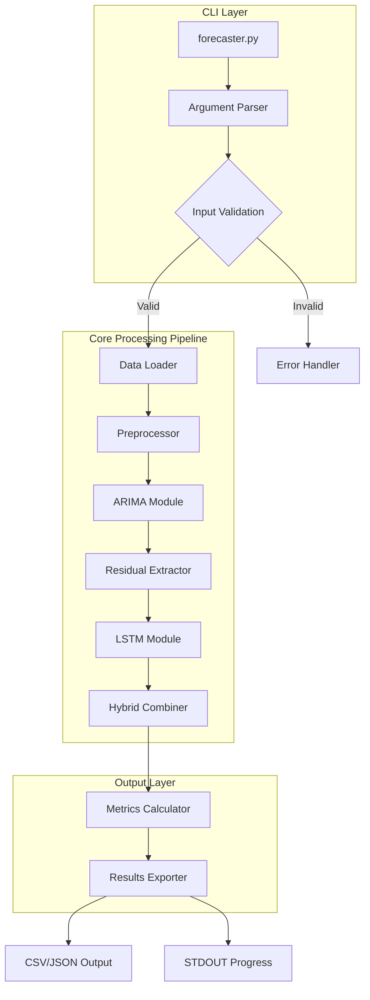

---

## 3. Component Architecture

### 3.1 System Components Overview

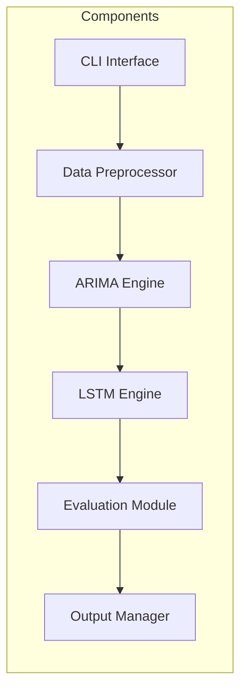

### 3.2 Component Responsibilities

| Component | Responsibility | Key Dependencies |
|-----------|----------------|------------------|
| CLI Interface | Parse arguments, validate inputs, orchestrate workflow | argparse/click |
| Data Preprocessor | Load data, impute missing values, calculate returns, reshape tensors | pandas, numpy |
| ARIMA Engine | Stationarity testing, auto-parameter selection, linear forecasting | statsmodels |
| LSTM Engine | Non-linear residual modeling, sequential pattern learning | tensorflow, keras |
| Evaluation Module | Calculate RMSE/MAE, walk-forward validation | numpy, sklearn |
| Output Manager | Export results to CSV/JSON, progress reporting | json, csv |

---

## 4. Detailed Component Design

### 4.1 CLI Interface Module

**File:** `forecaster.py`

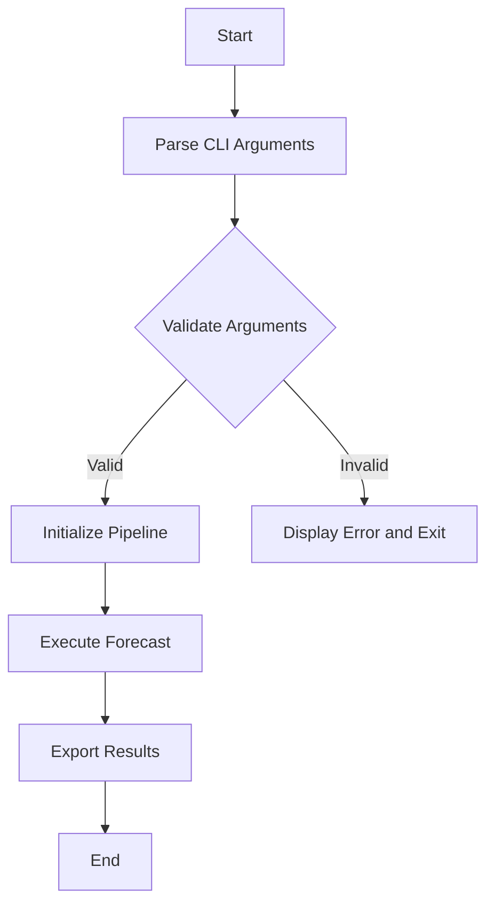

**CLI Arguments:**

| Argument | Type | Required | Description |
|----------|------|----------|-------------|
| `--input` | string | Yes | Path to input file - CSV or JSON |
| `--ticker` | string | Yes | Asset ticker symbol |
| `--horizon` | int | Yes | Forecast horizon - number of periods |
| `--output` | string | No | Output file path - default: stdout |
| `--config` | string | No | Path to model configuration file |

### 4.2 Data Preprocessor Module

**File:** `src/preprocessing.py`

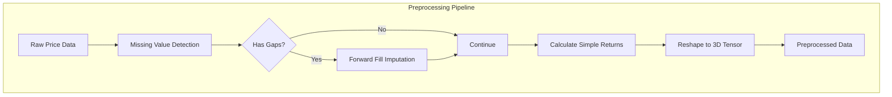

**Key Functions:**

| Function | Input | Output | Description |
|----------|-------|--------|-------------|
| `load_data` | file_path | pd.DataFrame | Load CSV/JSON data |
| `impute_missing` | pd.Series | pd.Series | Forward fill missing values at t with t-1 |
| `calculate_returns` | pd.Series | pd.Series | Compute R_t = P_t - P_t-1 / P_t-1 |
| `reshape_for_lstm` | np.array, window_size | np.array | Reshape to 3D: Samples, Time Steps, Features |

### 4.3 ARIMA Engine Module

**File:** `src/arima_engine.py`

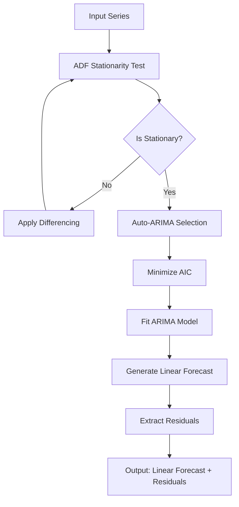

**Key Functions:**

| Function | Input | Output | Description |
|----------|-------|--------|-------------|
| `test_stationarity` | pd.Series | tuple - bool, p_value | Perform ADF test |
| `find_optimal_params` | pd.Series | tuple - p,d,q | Auto-ARIMA with AIC minimization |
| `fit_arima` | pd.Series, params | ARIMAResults | Fit ARIMA model |
| `extract_residuals` | pd.Series, ARIMAResults | pd.Series | Calculate residuals: actual - predicted |

### 4.4 LSTM Engine Module

**File:** `src/lstm_engine.py`

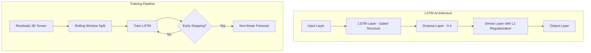

**LSTM Configuration:**

| Parameter | Default Value | Description |
|-----------|---------------|-------------|
| `hidden_layers` | 1 | Number of LSTM layers |
| `nodes` | 5-20 | Neurons per layer |
| `batch_size` | 64 | Training batch size |
| `dropout_rate` | 0.4 | Dropout regularization |
| `optimizer` | Adam | Optimization algorithm |
| `window_size` | 20-100 | Rolling window days |

**Key Functions:**

| Function | Input | Output | Description |
|----------|-------|--------|-------------|
| `build_lstm_model` | config | keras.Model | Construct LSTM architecture |
| `create_rolling_windows` | data, window_size | X, y arrays | Generate training sequences |
| `train_lstm` | model, X, y | trained model | Train with early stopping |
| `predict_residuals` | model, X | np.array | Generate non-linear predictions |

### 4.5 Hybrid Combiner Module

**File:** `src/hybrid_combiner.py`

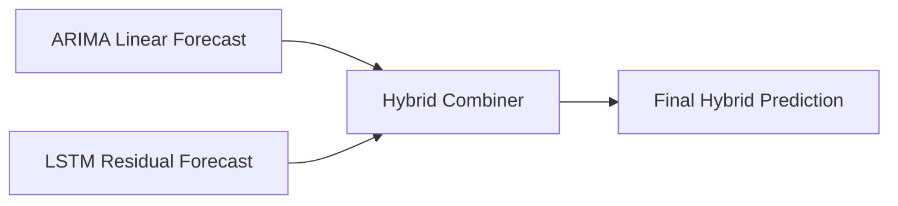

**Combination Formula:**

```
ŷ_t = L̂_t + N̂_t

Where:
- ŷ_t = Final hybrid forecast
- L̂_t = ARIMA linear prediction
- N̂_t = LSTM residual prediction
```

### 4.6 Evaluation Module

**File:** `src/evaluation.py`

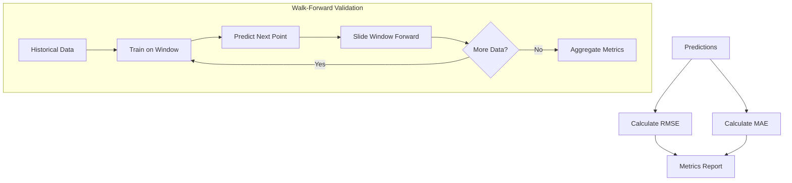

**Metrics:**

| Metric | Formula | Description |
|--------|---------|-------------|
| RMSE | √ mean of squared errors | Root Mean Squared Error |
| MAE | mean of absolute errors | Mean Absolute Error |

---

## 5. Data Flow Architecture

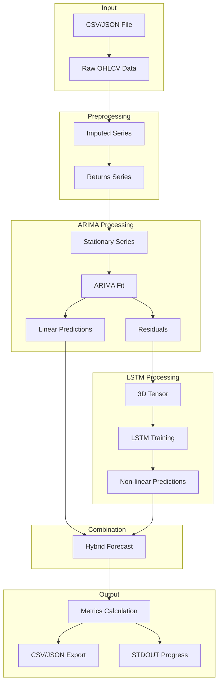

---

## 6. Directory Structure

```
LSTM_ARIMA_V2/
├── forecaster.py              # Main CLI entry point
├── config/
│   └── model_params.yml       # Model configuration
├── src/
│   ├── __init__.py
│   ├── preprocessing.py       # Data preprocessing module
│   ├── arima_engine.py        # ARIMA component
│   ├── lstm_engine.py         # LSTM component
│   ├── hybrid_combiner.py     # Hybrid combination logic
│   ├── evaluation.py          # Metrics and validation
│   └── output_manager.py      # Results export
├── tests/
│   ├── test_arima.py          # ARIMA unit tests
│   ├── test_lstm.py           # LSTM unit tests
│   └── test_hybrid_integration.py  # Integration tests
├── data/
│   └── sample/                # Sample input data
├── output/                    # Default output directory
├── plans/
│   └── architecture.md        # This document
├── requirements.txt           # Python dependencies
└── README.md                  # Project documentation
```

---

## 7. Configuration Schema

**File:** `config/model_params.yml`

```yaml
# ARIMA Configuration
arima:
  seasonal: false
  max_p: 5
  max_d: 2
  max_q: 5
  information_criterion: aic

# LSTM Configuration
lstm:
  hidden_layers: 1
  nodes: 10
  batch_size: 64
  epochs: 100
  dropout_rate: 0.4
  l2_regularization: 0.01
  window_size: 60
  optimizer: adam
  early_stopping_patience: 10

# Validation Configuration
validation:
  method: walk_forward
  test_size: 0.2

# Hardware Configuration
hardware:
  use_opencl: true
  gpu_memory_fraction: 0.8
```

---

## 8. Technology Stack

### 8.1 Runtime Requirements

| Requirement | Specification |
|-------------|---------------|
| Python Version | 3.11+ |
| Operating System | Cross-platform - Windows, Linux, macOS |

### 8.2 Core Dependencies

| Library | Version | Purpose |
|---------|---------|---------|
| pandas | >= 2.0 | Data manipulation |
| numpy | >= 1.24 | Numerical computing |
| statsmodels | >= 0.14 | ARIMA modeling, ADF tests |
| tensorflow | >= 2.15 | LSTM backend |
| keras | >= 3.0 | LSTM high-level API |
| scikit-learn | >= 1.3 | Metrics, preprocessing |
| argparse/click | stdlib/latest | CLI argument parsing |
| PyYAML | >= 6.0 | Configuration loading |
| pyopencl | >= 2023.1 | GPU acceleration - optional |

### 8.3 Standard Library Usage

- `pathlib` - File path handling
- `logging` - Training progress logging
- `math` - Mathematical operations
- `json` - JSON I/O
- `csv` - CSV I/O

---

## 9. Interface Contracts

### 9.1 Main Entry Point

```python
def run_hybrid_forecast(
    data: pd.DataFrame,
    forecast_horizon: int,
    config: dict = None
) -> dict:
    """
    Execute complete hybrid forecasting workflow.

    Args:
        data: Cleaned cryptocurrency price time series
        forecast_horizon: Number of time steps to forecast
        config: Optional model configuration overrides

    Returns:
        dict containing:
            - predictions: np.array of forecast values
            - arima_component: np.array of linear predictions
            - lstm_component: np.array of residual predictions
            - metrics: dict with RMSE and MAE values
            - model_params: dict with fitted ARIMA (p,d,q) params
    """
```

### 9.2 CLI Interface

```bash
# Basic usage
python forecaster.py --input data/btc_prices.csv --ticker BTC --horizon 10

# With custom output
python forecaster.py --input data/eth_prices.json --ticker ETH --horizon 30 --output results/forecast.csv

# With custom configuration
python forecaster.py --input data/btc_prices.csv --ticker BTC --horizon 10 --config config/custom_params.yml
```

---

## 10. Error Handling Strategy

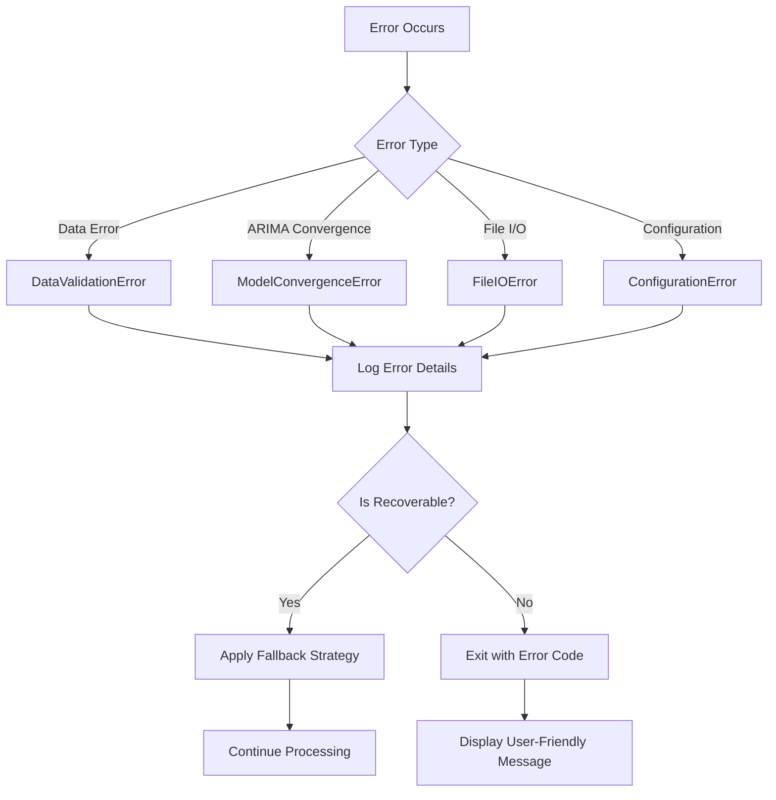

| Error Type | Recovery Strategy |
|------------|-------------------|
| Missing data file | Exit with clear file path error |
| Non-convergent ARIMA | Log warning, use default params |
| Invalid ticker | Exit with valid options list |
| GPU unavailable | Fallback to CPU processing |

---

## 11. Validation Strategy

### 11.1 Walk-Forward Validation

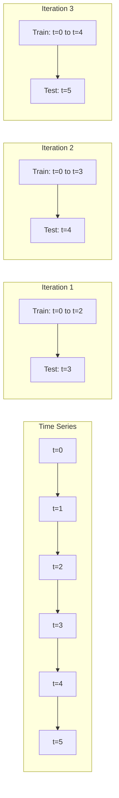

### 11.2 Test Coverage

| Test Type | File | Coverage |
|-----------|------|----------|
| Unit Tests | `test_arima.py` | ADF test, ARIMA fitting |
| Unit Tests | `test_lstm.py` | Model construction, tensor reshaping |
| Integration Tests | `test_hybrid_integration.py` | End-to-end pipeline |

---

## 12. Hardware Acceleration

### 12.1 OpenCL Integration

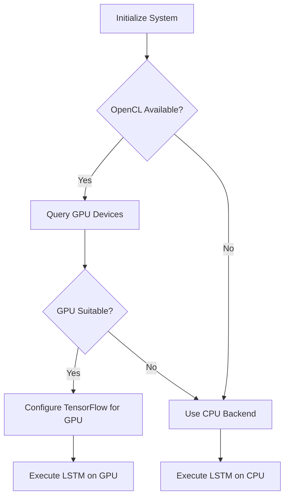

### 12.2 Performance Considerations

| Operation | CPU | GPU with OpenCL |
|-----------|-----|-----------------|
| ARIMA fitting | Default | N/A - CPU only |
| LSTM training | Slow | Accelerated |
| Matrix operations | NumPy | OpenCL parallelization |

---

## 13. Acceptance Criteria

| ID | Criterion | Validation Method |
|----|-----------|-------------------|
| AC1 | Hybrid model RMSE is lower than standalone ARIMA benchmark | Integration test comparison |
| AC2 | Model saves and loads training states to .pkl or .h5 files | Unit test for serialization |
| AC3 | No temporal data leakage | Code review, validation test |
| AC4 | LSTM activation encompasses residual range of -2 to 2 | Architecture verification |
| AC5 | CLI accepts all specified arguments | CLI integration test |
| AC6 | Progress output to STDOUT during training | Manual verification |

---

## 14. Security and Constraints

### 14.1 Data Integrity Constraints

- **Temporal Order:** No future data leakage - strict train/test separation
- **Data Validation:** Input validation before processing
- **Error Boundaries:** Graceful degradation on invalid inputs

### 14.2 Model Constraints

- LSTM activation must handle residual correlation range of -2 to 2
- ARIMA differencing limited to d <= 2 for stability
- Early stopping to prevent overfitting

---

## 15. Appendix: Mathematical Foundations

### 15.1 Simple Returns Calculation

```
R_t = (P_t - P_{t-1}) / P_{t-1}
```

### 15.2 ADF Test Hypothesis

- H0: Series has a unit root (non-stationary)
- H1: Series is stationary
- Reject H0 if p-value < 0.05

### 15.3 ARIMA Model

```
(1 - Σφ_i * L^i)(1 - L)^d * X_t = (1 + Σθ_j * L^j) * ε_t
```

Where:
- φ_i = AR coefficients
- θ_j = MA coefficients
- L = Lag operator
- d = Differencing order

### 15.4 LSTM Gate Equations

```
Forget gate:    f_t = σ(W_f · [h_{t-1}, x_t] + b_f)
Input gate:     i_t = σ(W_i · [h_{t-1}, x_t] + b_i)
Candidate:      C̃_t = tanh(W_C · [h_{t-1}, x_t] + b_C)
Cell state:     C_t = f_t * C_{t-1} + i_t * C̃_t
Output gate:    o_t = σ(W_o · [h_{t-1}, x_t] + b_o)
Hidden state:   h_t = o_t * tanh(C_t)
```

---

*Document Version: 1.0*
*Last Updated: 2026-01-07*
